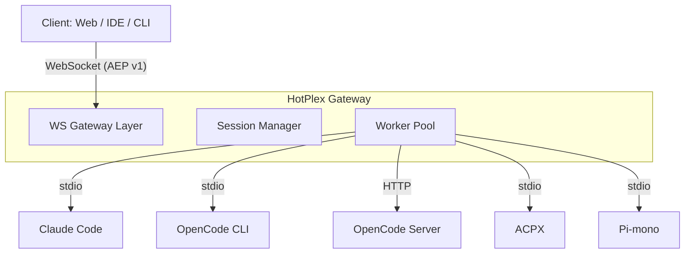

# HotPlex Worker Gateway

[](https://pkg.go.dev/hotplex-worker)
[](https://goreportcard.com/report/github.com/hrygo/hotplex-worker)
[](https://codecov.io/gh/hrygo/hotplex-worker)
[](https://opensource.org/licenses/Apache-2.0)

**HotPlex Worker Gateway** is a high-performance, unified access layer for managing AI Coding Agent sessions. It abstracts protocol differences across agents and provides a standardized, stateful WebSocket interface.

## Features

- **Unified Protocol** — [AEP v1 (Agent Exchange Protocol)](docs/architecture/AEP-v1-Protocol.md) over WebSockets
- **5 Worker Adapters** — Claude Code, OpenCode CLI, OpenCode Server, ACPX, Pi-mono
- **Session Lifecycle** — Create / Resume / Terminate / GC with SQLite persistence and UUIDv5 session IDs
- **Process Isolation** — PGID isolation with layered SIGTERM → SIGKILL termination
- **Security** — ES256 JWT, SSRF protection, command whitelist, env isolation, AI tool policy
- **Admin API** — Real-time stats, health checks, session CRUD, dynamic config hot-reload
- **Client SDKs** — TypeScript, Python, Java, and Go SDKs with working examples
- **Web Chat UI** — Next.js chat interface powered by Vercel AI SDK transport adapter
- **Cloud Native** — Prometheus metrics, OpenTelemetry tracing, PGO-optimized builds

## Architecture



See [Architecture Design](docs/architecture/Worker-Gateway-Design.md) for details.

## Quick Start

### Prerequisites

- Go 1.26+
- SQLite3

### Build & Run

```bash
git clone https://github.com/hrygo/hotplex-worker.git
cd hotplex-worker
make build

# Start with default config
./bin/gateway --config configs/config.yaml

# Development mode (relaxed security)
./bin/gateway --dev
```

### Configuration

See [configs/README.md](configs/README.md) for full configuration reference, including hot-reload, environment variables, and multi-environment setups.

## Client SDKs

| Language | Directory | Protocol |
|----------|-----------|----------|
| TypeScript | [examples/typescript-client](examples/typescript-client) | WebSocket (AEP v1) |
| Python | [examples/python-client](examples/python-client) | WebSocket (AEP v1) |
| Java | [examples/java-client](examples/java-client) | WebSocket (AEP v1) |
| Go | [client](client/) | WebSocket (AEP v1) |

### Web Chat UI

A Next.js web chat interface is available at [webchat/](webchat/), using the [`@hotplex/ai-sdk-transport`](packages/ai-sdk-transport) adapter for Vercel AI SDK integration.

## Documentation

| Document | Description |
|----------|-------------|
| [Architecture Design](docs/architecture/Worker-Gateway-Design.md) | System design and constraints |
| [AEP v1 Protocol](docs/architecture/AEP-v1-Protocol.md) | Wire format, events, versioning |
| [AEP v1 Appendix](docs/architecture/AEP-v1-Appendix.md) | Sequence diagrams, state machines |
| [WebSocket Full-Duplex Flow](docs/architecture/WebSocket-Full-Duplex-Flow.md) | Connection lifecycle and race prevention |
| [User Manual](docs/User-Manual.md) | API usage, lifecycle, examples |
| [Security](docs/security/) | JWT, input validation, SSRF, tool policy |
| [Testing Strategy](docs/testing/Testing-Strategy.md) | Unit / integration / e2e testing |

## Contributing

See [CONTRIBUTING.md](CONTRIBUTING.md) for development workflow, PR guidelines, and testing standards.

## License

[Apache License 2.0](LICENSE)
