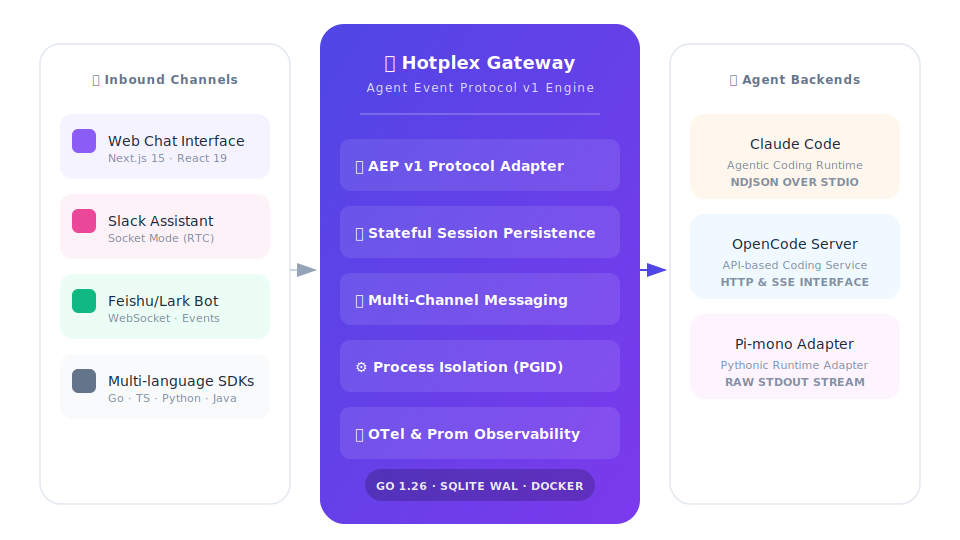

<h1 align="center">Hotplex 网关</h1>

<p align="center">
  <strong>AI Coding Agent 统一接入桥梁</strong>
</p>

<p align="center">
  <strong>简体中文</strong> | <a href="README.md">English</a>
</p>

<p align="center">
  <a href="https://github.com/hrygo/hotplex/actions/workflows/ci.yml"></a>
  <a href="https://github.com/hrygo/hotplex/blob/main/LICENSE"></a>
  
  
  
  <a href="https://github.com/hrygo/hotplex/stargazers"></a>
</p>

---

Hotplex 是一个高性能的 Go 语言编写的网关，它提供**统一的 WebSocket 接口**来接入任何 AI Coding Agent。它抽象了不同 Agent 之间的协议差异，管理复杂的会话生命周期，并将用户连接到 Web、Slack 和飞书——这一切只需一个优化的二进制文件即可完成。

**一个网关。任意 Agent。全渠道接入。**

## 🧭 目录
- [核心特性](#-核心特性)
- [快速开始](#-快速开始)
- [系统架构](#-系统架构)
- [SDK 与客户端库](#-sdk-与客户端库)
- [配置说明](#-配置说明)
- [文档中心](#-文档中心)
- [参与贡献](#-参与贡献)
- [开源协议](#-开源协议)

## 🚀 核心特性

### 🔌 极致互联
- 🔹 **统一 AEP v1 协议**: 通过 WebSocket 提供 23+ 种事件类型（流式输出、权限交互、MCP Elicitation）。
- 🔹 **多渠道桥接**: 双向支持 **Slack** (Socket Mode) 和 **飞书** (WebSocket)，具备完整的交互能力。
- 🔹 **Worker 适配器**: 开箱即用支持 Claude Code、OpenCode Server 和 Pi-mono。

### 🛡️ 可靠与安全
- 🔹 **健壮的会话管理**: 5 状态生命周期状态机，支持崩溃恢复和断线重连。
- 🔹 **安全至上**: JWT ES256 认证、SSRF 防护以及命令白名单机制。
- 🔹 **可观测性**: 内置 Prometheus 指标、OpenTelemetry 链路追踪和结构化 JSON 日志。
- 🔹 **管理 API**: 提供专门的 Admin API 用于会话控制和健康监测。

### 💎 开发者体验
- 🔹 **CLI 自服务**: 内置交互式 `onboard` 向导、`doctor` 诊断、`security` 安全审计、`status` 状态检查、`config validate` 配置验证 — 全集成在单个二进制中。
- 🔹 **即插即用的 Web UI**: 基于 Next.js 15 和 Vercel AI SDK 构建，全新浅色主题和持久侧边栏。
- 🔹 **配置热重载**: 无需停机即可实时更新网关设置。
- 🔹 **多语言 SDK**: 原生支持 Go、TypeScript、Python 和 Java。

## ⚡ 快速开始

### 1. 安装
```bash
git clone https://github.com/hrygo/hotplex.git
cd hotplex
make quickstart
```

### 2. 配置

```bash
# 交互式配置向导（自动检测已有配置，支持保留或重新配置）
./hotplex onboard

# 或快速自动生成全部配置：
./hotplex onboard --non-interactive --enable-slack --enable-feishu
```

### 3. 启动开发服务器
```bash
make dev
```
- **网关**: `http://localhost:8888`
- **Web Chat**: `http://localhost:3000`

### 3. 使用 Go SDK 连接
```go
package main

import (
    "context"
    "fmt"
    client "github.com/hrygo/hotplex/client"
)

func main() {
    c, _ := client.Connect(context.Background(), "ws://localhost:8888/ws",
        client.WithToken("<your-jwt-token>"),
    )
    defer c.Close()

    c.SendInput(context.Background(), "解释一下 Hotplex 架构")

    for env := range c.Events() {
        if env.Event.Type == "message.delta" {
            fmt.Print(env.Event.Data.(map[string]any)["content"])
        }
    }
}
```

## 🧱 系统架构

Hotplex 在前端客户端和后端 Coding Agent 之间充当编排层。



## 📦 SDK 与客户端库

| 语言 | 路径 | 特性 |
|:---:|:---|:---|
| **Go** | [`client/`](client/) | **全功能支持**, 事件驱动, 生产级可用 |
| **TypeScript** | [`examples/typescript/`](examples/typescript-client/) | 流式、多轮对话、兼容 React |
| **Python** | [`examples/python/`](examples/python-client/) | Asyncio 支持、会话恢复、CLI 友好 |
| **Java** | [`examples/java/`](examples/java-client/) | 企业级 AEP v1 协议实现 |

## 🛠️ 配置说明

Hotplex 使用 Viper 进行配置管理，并支持环境变量覆盖。

| 配置项 | 默认值 | 说明 |
|:---|:---|:---|
| `gateway.addr` | `:8888` | WebSocket 网关地址 |
| `admin.addr` | `:9999` | Admin API 地址 |
| `db.path` | `data/hotplex.db` | SQLite 数据库路径 |
| `log.level` | `info` | 日志级别 (debug, info, warn, error) |

> [!TIP]
> 完整的环境变量和 YAML 设置请参考 [配置指南](docs/management/Config-Reference.md)。

## 📖 文档中心

| 领域 | 指南 |
|:---|:---|
| **入门指南** | [快速上手](docs/User-Manual.md) · [技术参考手册](docs/Reference-Manual.md) · [产品白皮书](docs/Product-Whitepaper.md) |
| **协议规范** | [AEP v1 协议详解](docs/architecture/AEP-v1-Protocol.md) |
| **内部设计** | [网关架构设计](docs/architecture/Worker-Gateway-Design.md) · [安全认证](docs/security/Security-Authentication.md) |
| **运维管理** | [Admin API 手册](docs/management/Admin-API-Design.md) · [测试策略](docs/testing/Testing-Strategy.md) |

## 👥 参与贡献

我们欢迎任何形式的贡献！请阅读 [贡献指南](CONTRIBUTING.md) 了解更多细节。

1. Fork 本项目
2. 创建您的特性分支 (`git checkout -b feat/AmazingFeature`)
3. 提交您的更改 (`git commit -m 'feat: Add some AmazingFeature'`)
4. 推送到分支 (`git push origin feat/AmazingFeature`)
5. 开启一个 Pull Request

## 🛡️ 安全

如果您发现安全漏洞，请不要公开开启 Issue。请通过 [安全政策](SECURITY.md) 中的说明报告漏洞（或直接联系维护者）。

## 📜 开源协议

本项目采用 Apache License 2.0 协议。更多信息请参阅 [`LICENSE`](LICENSE)。

---

<p align="center">
  Hotplex 团队倾力打造 ❤️
</p>
