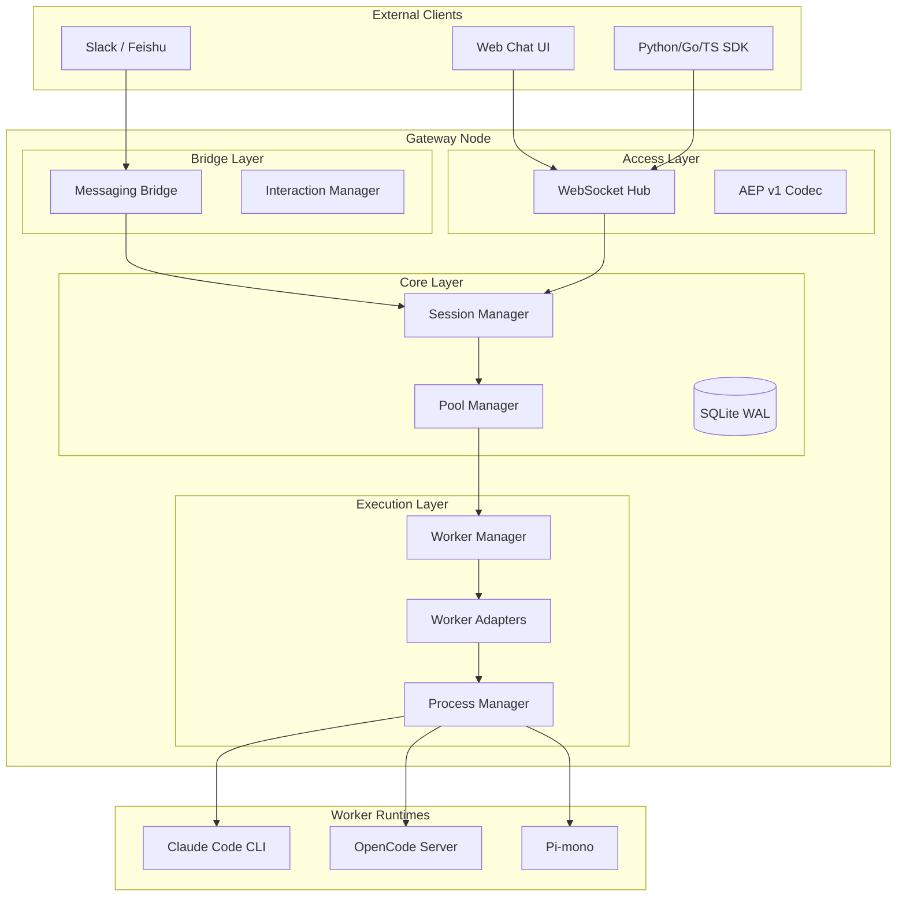

# HotPlex Worker Gateway — 架构设计 (Architecture Design)

> **项目定位**：HotPlex Worker Gateway 是一个统一的 AI Agent 接入网关，旨在通过 AEP (Agent Exchange Protocol) 协议屏蔽底层不同 AI Coding Agent（如 Claude Code, OpenCode Server 等）在运行环境、通信协议、生命周期管理上的差异。

---

## 1. 总体架构图

HotPlex 采用分层解耦的架构，分为接入层（Access）、桥接层（Bridge）、核心管理层（Core）和执行层（Execution）。

---

## 2. 核心概念

### 2.1 AEP 协议 (Agent Exchange Protocol)
项目定义了 **AEP v1** 协议，这是一个基于 JSON 的事件封包协议（Envelope）。它解耦了客户端与 Worker 之间的具体实现细节，支持流式输出、工具调用通知、权限交互等 17 种标准事件。

### 2.2 确定性会话 (Deterministic Session)
会话 ID (SessionID) 的生成采用 **UUIDv5** 映射算法。通过 `(owner_id, worker_type, client_session_id)` 的三元组映射，确保在分布式环境下（配合 Sticky Session）用户能精确回到其对应的运行环境。

### 2.3 适配器模式 (Adapter Pattern)
- **Worker Adapter**：将不同的底层通信方式（Stdio, HTTP/SSE）统一转换为 AEP 事件流。
- **Messaging Adapter**：将不同的社交平台（Slack, 飞书）消息逻辑抽象，统一对接核心 Session 逻辑。

---

## 3. 技术栈与关键特性

### 3.1 关键技术栈
- **语言**：Go 1.26+ (利用高并发性能与静态编译优势)
- **存储**：SQLite (WAL 模式，单写 goroutine 保证原子性)
- **安全**：ES256 JWT, PGID 进程组隔离
- **通信**：WebSocket (AEP v1), REST (Admin API)

### 3.2 核心特性
1.  **热插拔 Worker 引擎**：通过 `init()` 注册机制实现新 Worker 类型的零侵入接入。
2.  **资源配额治理**：全局与单用户维度的并发会话数限制及内存预测追踪 (Memory-aware Pool)。
3.  **LLM 自动重试**：内置 429/5xx 等典型 LLM 错误的正则识别与指数退避自动重试机制。
4.  **配置热重载**：支持不中断服务的情况下更新关键运行参数，并具备版本回滚能力。

---

## 4. 安全体系

HotPlex 构建了四层安全防御体系：
1.  **认证层**：ES256 JWT 签名验证 + API Key 校验。
2.  **隔离层**：独立的进程组 (PGID) 隔离，禁止 Worker 访问网关环境变量。
3.  **网络层**：SSRF 防护（私有 IP 阻断）、URL 白名单校验。
4.  **内容层**：Shell 元字符过滤、敏感环境变量自动脱敏。

---

## 5. 部署模型

项目针对 POSIX 系统设计，利用 `syscall` 提供的进程组管理能力。支持容器化部署，建议在生产环境中使用 Sticky Session 负载均衡器，以保证 Session 恢复时的状态亲和性。
