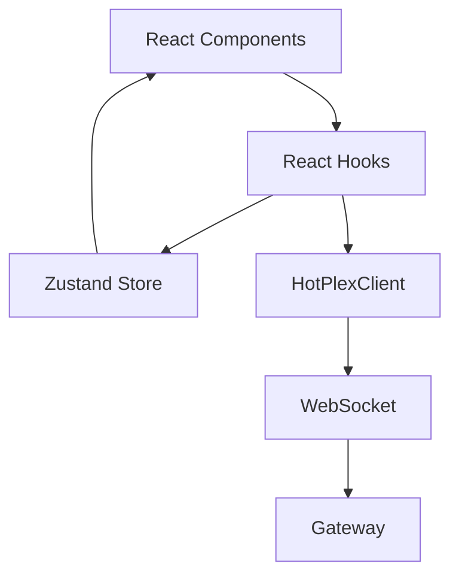

# HotPlex Worker 前端集成方案设计

> **文档版本**: 1.1.0
> **日期**: 2026-04-03
> **状态**: Draft
> **修正**（2026-04-21）：
> - `examples/typescript-client/` 目录已不存在，前端集成请使用 `webchat/lib/ai-sdk-transport/` 中的 AI SDK Transport 或 `client/` Go SDK
> - TypeScript 客户端（562 行）描述已过时，当前 webchat 使用 Next.js + AI SDK Transport 架构

---

## 目录

1. [方案概览](#方案概览)
2. [集成路径对比](#集成路径对比)
3. [推荐方案：React Hook + Zustand](#推荐方案react-hook--zustand)
4. [架构设计](#架构设计)
5. [代码实现](#代码实现)
6. [最佳实践](#最佳实践)
7. [故障排查](#故障排查)

---

## 方案概览

### 设计目标

- ✅ **最小化开发成本**：复用现有 TypeScript 客户端（562 行生产级代码）
- ✅ **类型安全**：完整的 TypeScript 类型定义
- ✅ **框架无关**：支持 React/Vue/Angular/Vanilla JS
- ✅ **状态管理集成**：可与 Zustand/Jotai/Redux 无缝集成
- ✅ **可观测性**：内置性能监控和错误追踪

### 核心优势

| 优势 | 说明 |
|------|------|
| **生产级质量** | 客户端已充分测试（单元测试 + 集成测试） |
| **功能完整** | 自动重连、心跳保活、背压处理、Session Busy 重试 |
| **协议兼容** | 完整实现 AEP v1 协议（17 种事件类型） |
| **零学习成本** | EventEmitter 模式前端熟悉 |

---

## 集成路径对比

### 方案 A: 直接使用 TypeScript 客户端 SDK ⭐⭐⭐⭐⭐ (推荐)

**适用场景**: 所有前端项目（React/Vue/Angular/Vanilla JS）

**优点**:
- ✅ 开发时间：1-2 天（验证 + 集成）
- ✅ 维护成本：低（跟随上游更新）
- ✅ 风险：低（已充分测试）
- ✅ 功能完整（重连/心跳/背压）

**缺点**:
- ⚠️ 需要安装 Node.js 依赖（`ws`, `eventemitter3`）
- ⚠️ Bundle 增加 ~50KB（gzip 后 ~15KB）

**集成步骤**:
```bash
# 1. 复制客户端代码
cp -r examples/typescript-client/src your-project/src/hotplex-client  # ⚠️ 目录不存在，请使用 webchat/lib/ai-sdk-transport/

# 2. 安装依赖
npm install ws eventemitter3

# 3. 添加 React Hook 封装（见下文）
```

---

### 方案 B: 封装为 Web Component ⭐⭐⭐

**适用场景**: 需要框架无关的组件

**优点**:
- ✅ 框架无关（可在 React/Vue/Angular 中使用）
- ✅ 封装性强（内部实现对外透明）

**缺点**:
- ⚠️ 开发时间：3-4 天（封装 + 测试）
- ⚠️ 灵活性降低（定制化困难）

---

### 方案 C: 自定义轻量客户端 ⭐⭐ (不推荐)

**适用场景**: 极端追求 Bundle 大小

**优点**:
- ✅ Bundle 最小（~10KB gzip）

**缺点**:
- ❌ 开发时间：5-7 天
- ❌ 测试时间：3-5 天
- ❌ 维护成本：高（自行维护）
- ❌ 风险：高（边界情况遗漏）

**不推荐原因**: 
- 协议实现复杂（背压/心跳/重连）
- 边界情况多（Session Busy、背压丢弃、权限请求）
- 现有客户端已优化（562 行实现所有功能）

---

## 推荐方案：React Hook + Zustand

### 架构分层

```
┌─────────────────────────────────────────────────────┐
│  React Components                                 │  ← UI 层
│  - ChatInterface                                   │
│  - MessageList                                      │
│  - InputBox                                         │
├─────────────────────────────────────────────────────┤
│  React Hooks                                        │  ← Hook 层
│  - useHotPlexSession()                             │
│  - useMessageBuffer()                              │
│  - useConnectionState()                            │
├─────────────────────────────────────────────────────┤
│  Zustand Store                                      │  ← 状态管理层
│  - messages: Message[]                              │
│  - connectionState: 'connected' | 'disconnected'   │
│  - sessionId: string                                │
├─────────────────────────────────────────────────────┤
│  HotPlexClient (现有 SDK)                          │  ← 客户端层
│  - WebSocket 连接管理                               │
│  - 事件发射 (EventEmitter3)                        │
│  - 自动重连 + 心跳                                 │
├─────────────────────────────────────────────────────┤
│  AEP v1 Protocol (NDJSON)                         │  ← 协议层
│  - message.start/delta/end                        │
│  - done/error/state                                │
└─────────────────────────────────────────────────────┘
```

### 数据流

```
用户输入 → sendInput()
         ↓
    HotPlexClient.sendInput()
         ↓
    WebSocket.send(NDJSON)
         ↓
    Gateway → Worker
         ↓
    Worker → message.delta*
         ↓
    WebSocket.onmessage
         ↓
    HotPlexClient.emit('delta')
         ↓
    Zustand.setMessage()
         ↓
    React re-render
```

---

## 架构设计

### 1. 目录结构

```
src/
├── hotplex-client/              # ⚠️ 目录不存在，请参考 webchat/lib/ai-sdk-transport/
│   ├── client.ts
│   ├── types.ts
│   ├── constants.ts
│   └── envelope.ts
│
├── hooks/
│   ├── useHotPlexSession.ts    # 主 Hook：管理连接
│   ├── useMessageBuffer.ts     # 消息缓冲与批量更新
│   └── useConnectionState.ts   # 连接状态监控
│
├── stores/
│   ├── chatStore.ts            # Zustand store：消息 + 连接状态
│   └── settingsStore.ts        # 配置管理
│
├── components/
│   ├── ChatInterface.tsx       # 主界面
│   ├── MessageList.tsx         # 消息列表
│   ├── InputBox.tsx            # 输入框
│   └── ConnectionStatus.tsx    # 连接状态指示器
│
└── types/
    └── chat.ts                  # 前端业务类型定义
```

### 2. 依赖关系



---

## 代码实现

### 1. Zustand Store (状态管理)

```typescript
// src/stores/chatStore.ts
import { create } from 'zustand';
import { devtools, persist } from 'zustand/middleware';

export interface Message {
  id: string;
  role: 'user' | 'assistant';
  content: string;
  timestamp: number;
  isStreaming?: boolean;
}

export interface ConnectionState {
  status: 'connecting' | 'connected' | 'disconnected' | 'reconnecting';
  attempt?: number;
  sessionId?: string;
}

interface ChatStore {
  // State
  messages: Message[];
  connectionState: ConnectionState;
  inputEnabled: boolean;
  
  // Actions
  addMessage: (message: Message) => void;
  updateLastMessage: (content: string) => void;
  setConnectionState: (state: ConnectionState) => void;
  setInputEnabled: (enabled: boolean) => void;
  clearMessages: () => void;
}

export const useChatStore = create<ChatStore>()(
  devtools(
    persist(
      (set) => ({
        // Initial state
        messages: [],
        connectionState: { status: 'disconnected' },
        inputEnabled: false,
        
        // Actions
        addMessage: (message) =>
          set((state) => ({
            messages: [...state.messages, message],
          })),
        
        updateLastMessage: (content) =>
          set((state) => {
            const messages = [...state.messages];
            const last = messages[messages.length - 1];
            if (last) {
              messages[messages.length - 1] = {
                ...last,
                content,
                isStreaming: false,
              };
            }
            return { messages };
          }),
        
        setConnectionState: (connectionState) =>
          set({ connectionState }),
        
        setInputEnabled: (inputEnabled) =>
          set({ inputEnabled }),
        
        clearMessages: () =>
          set({ messages: [] }),
      }),
      { name: 'chat-store' }
    )
  )
);
```

### 2. React Hook：useHotPlexSession

```typescript
// src/hooks/useHotPlexSession.ts
import { useEffect, useRef, useCallback } from 'react';
import { HotPlexClient } from '../hotplex-client/client';
import { useChatStore } from '../stores/chatStore';

export interface HotPlexSessionConfig {
  url: string;
  workerType?: string;
  apiKey?: string;
  authToken?: string;
}

export function useHotPlexSession(config: HotPlexSessionConfig) {
  const clientRef = useRef<HotPlexClient | null>(null);
  
  const {
    addMessage,
    updateLastMessage,
    setConnectionState,
    setInputEnabled,
  } = useChatStore();
  
  // Initialize client
  useEffect(() => {
    const client = new HotPlexClient({
      url: config.url,
      workerType: config.workerType || 'claude-code',
      apiKey: config.apiKey,
      authToken: config.authToken,
    });
    
    // Event handlers
    client.on('connected', (ack) => {
      setConnectionState({
        status: 'connected',
        sessionId: client.sessionId,
      });
      console.log('[HotPlex] Connected:', client.sessionId);
    });
    
    client.on('disconnected', (reason) => {
      setConnectionState({ status: 'disconnected' });
      setInputEnabled(false);
      console.log('[HotPlex] Disconnected:', reason);
    });
    
    client.on('reconnecting', (attempt) => {
      setConnectionState({
        status: 'reconnecting',
        attempt,
      });
      console.log(`[HotPlex] Reconnecting... attempt ${attempt}/10`);
    });
    
    // Message streaming
    client.on('messageStart', (data) => {
      addMessage({
        id: data.id,
        role: data.role,
        content: '',
        timestamp: Date.now(),
        isStreaming: true,
      });
    });
    
    client.on('delta', (data) => {
      // 使用函数式更新避免批量更新丢失
      useChatStore.setState((state) => {
        const messages = [...state.messages];
        const last = messages[messages.length - 1];
        if (last && last.isStreaming) {
          messages[messages.length - 1] = {
            ...last,
            content: last.content + data.content,
          };
        }
        return { messages };
      });
    });
    
    client.on('messageEnd', (data) => {
      useChatStore.setState((state) => {
        const messages = [...state.messages];
        const last = messages[messages.length - 1];
        if (last) {
          messages[messages.length - 1] = {
            ...last,
            isStreaming: false,
          };
        }
        return { messages };
      });
    });
    
    // Task completion
    client.on('done', (data) => {
      setInputEnabled(true);
      console.log('[HotPlex] Task completed:', data.success);
      
      if (!data.success) {
        console.error('[HotPlex] Task failed');
      }
    });
    
    // Error handling
    client.on('error', (data) => {
      console.error('[HotPlex] Error:', data.code, data.message);
      
      if (data.code === 'SESSION_BUSY') {
        console.warn('[HotPlex] Session busy, will auto-retry...');
      }
    });
    
    // Connect
    client.connect();
    clientRef.current = client;
    
    return () => {
      console.log('[HotPlex] Cleaning up...');
      client.disconnect();
    };
  }, [config.url, config.workerType, config.apiKey, config.authToken]);
  
  // Send input function
  const sendInput = useCallback((content: string) => {
    if (!clientRef.current) {
      console.error('[HotPlex] Client not initialized');
      return;
    }
    
    // Add user message
    addMessage({
      id: `user-${Date.now()}`,
      role: 'user',
      content,
      timestamp: Date.now(),
    });
    
    // Disable input while processing
    setInputEnabled(false);
    
    // Send to worker
    clientRef.current.sendInput(content);
  }, [addMessage, setInputEnabled]);
  
  return {
    client: clientRef.current,
    sendInput,
  };
}
```

### 3. React 组件：ChatInterface

```typescript
// src/components/ChatInterface.tsx
import React, { useState } from 'react';
import { useHotPlexSession } from '../hooks/useHotPlexSession';
import { useChatStore } from '../stores/chatStore';
import { ConnectionStatus } from './ConnectionStatus';
import { MessageList } from './MessageList';
import { InputBox } from './InputBox';

export function ChatInterface() {
  const { sendInput } = useHotPlexSession({
    url: 'ws://localhost:8888',
    workerType: 'claude-code',
  });
  
  const { messages, connectionState, inputEnabled } = useChatStore();
  const [input, setInput] = useState('');
  
  const handleSend = () => {
    if (!input.trim() || !inputEnabled) return;
    
    sendInput(input);
    setInput('');
  };
  
  return (
    <div className="chat-interface">
      <ConnectionStatus state={connectionState} />
      
      <MessageList messages={messages} />
      
      <InputBox
        value={input}
        onChange={setInput}
        onSend={handleSend}
        disabled={!inputEnabled || connectionState.status !== 'connected'}
        placeholder={
          connectionState.status === 'reconnecting'
            ? `Reconnecting... (attempt ${connectionState.attempt}/10)`
            : 'Type your message...'
        }
      />
    </div>
  );
}
```

### 4. 消息列表组件

```typescript
// src/components/MessageList.tsx
import React from 'react';
import { Message } from '../stores/chatStore';

interface Props {
  messages: Message[];
}

export function MessageList({ messages }: Props) {
  return (
    <div className="message-list">
      {messages.map((msg) => (
        <div
          key={msg.id}
          className={`message message-${msg.role}`}
        >
          <div className="message-role">
            {msg.role === 'user' ? '👤 You' : '🤖 Assistant'}
          </div>
          <div className="message-content">
            {msg.content}
            {msg.isStreaming && <span className="cursor">▊</span>}
          </div>
        </div>
      ))}
    </div>
  );
}
```

### 5. 连接状态组件

```typescript
// src/components/ConnectionStatus.tsx
import React from 'react';
import { ConnectionState } from '../stores/chatStore';

interface Props {
  state: ConnectionState;
}

export function ConnectionStatus({ state }: Props) {
  const statusMap = {
    connecting: { emoji: '🔄', text: 'Connecting...' },
    connected: { emoji: '🟢', text: `Connected (${state.sessionId})` },
    disconnected: { emoji: '🔴', text: 'Disconnected' },
    reconnecting: { emoji: '🔄', text: `Reconnecting (attempt ${state.attempt}/10)` },
  };
  
  const { emoji, text } = statusMap[state.status];
  
  return (
    <div className="connection-status">
      <span>{emoji}</span>
      <span>{text}</span>
    </div>
  );
}
```

### 6. 输入框组件

```typescript
// src/components/InputBox.tsx
import React, { KeyboardEvent } from 'react';

interface Props {
  value: string;
  onChange: (value: string) => void;
  onSend: () => void;
  disabled?: boolean;
  placeholder?: string;
}

export function InputBox({ value, onChange, onSend, disabled, placeholder }: Props) {
  const handleKeyPress = (e: KeyboardEvent<HTMLTextAreaElement>) => {
    if (e.key === 'Enter' && !e.shiftKey) {
      e.preventDefault();
      onSend();
    }
  };
  
  return (
    <div className="input-box">
      <textarea
        value={value}
        onChange={(e) => onChange(e.target.value)}
        onKeyPress={handleKeyPress}
        disabled={disabled}
        placeholder={placeholder}
        rows={3}
      />
      <button onClick={onSend} disabled={disabled || !value.trim()}>
        Send
      </button>
    </div>
  );
}
```

---

## 最佳实践

### 1. 错误边界处理

```typescript
// src/components/ErrorBoundary.tsx
import React from 'react';
import { ErrorBoundary } from 'react-error-boundary';

function ErrorFallback({ error, resetErrorBoundary }) {
  return (
    <div className="error-boundary">
      <h2>Something went wrong</h2>
      <p>{error.message}</p>
      <button onClick={resetErrorBoundary}>Try again</button>
    </div>
  );
}

export function App() {
  return (
    <ErrorBoundary FallbackComponent={ErrorFallback}>
      <ChatInterface />
    </ErrorBoundary>
  );
}
```

### 2. 性能优化

#### 2.1 消息批量更新（避免频繁重渲染）

```typescript
// src/hooks/useMessageBuffer.ts
import { useEffect, useRef } from 'react';
import { useChatStore } from '../stores/chatStore';

export function useMessageBuffer() {
  const bufferRef = useRef<string[]>([]);
  const rafIdRef = useRef<number>(0);
  
  useEffect(() => {
    const flush = () => {
      const buffer = bufferRef.current;
      if (buffer.length === 0) return;
      
      const combined = buffer.join('');
      bufferRef.current = [];
      
      useChatStore.setState((state) => {
        const messages = [...state.messages];
        const last = messages[messages.length - 1];
        if (last && last.isStreaming) {
          messages[messages.length - 1] = {
            ...last,
            content: last.content + combined,
          };
        }
        return { messages };
      });
    };
    
    // 使用 RAF 进行批量更新（16ms 一次）
    const scheduleFlush = () => {
      rafIdRef.current = requestAnimationFrame(() => {
        flush();
        if (bufferRef.current.length > 0) {
          scheduleFlush();
        }
      });
    };
    
    return () => {
      cancelAnimationFrame(rafIdRef.current);
    };
  }, []);
  
  return (content: string) => {
    bufferRef.current.push(content);
  };
}
```

#### 2.2 虚拟滚动（长消息列表）

```typescript
// 安装 react-window
// npm install react-window

import { FixedSizeList } from 'react-window';

export function MessageList({ messages }: Props) {
  return (
    <FixedSizeList
      height={600}
      itemCount={messages.length}
      itemSize={100}
      width="100%"
    >
      {({ index, style }) => (
        <div style={style}>
          <MessageItem message={messages[index]} />
        </div>
      )}
    </FixedSizeList>
  );
}
```

### 3. 可观测性

#### 3.1 性能监控

```typescript
// src/hooks/useConnectionState.ts
import { useEffect } from 'react';
import { HotPlexClient } from '../hotplex-client/client';

export function useConnectionState(client: HotPlexClient | null) {
  useEffect(() => {
    if (!client) return;
    
    const startTime = Date.now();
    
    client.on('connected', () => {
      const connectTime = Date.now() - startTime;
      console.log(`[Metrics] Connection time: ${connectTime}ms`);
      
      // 发送到监控系统
      if (window.analytics) {
        window.analytics.track('hotplex_connected', {
          connect_time_ms: connectTime,
        });
      }
    });
    
    client.on('delta', (data) => {
      const messageSize = data.content.length;
      
      if (window.analytics) {
        window.analytics.track('hotplex_message_delta', {
          size_bytes: messageSize,
        });
      }
    });
    
    client.on('disconnected', (reason) => {
      if (window.analytics) {
        window.analytics.track('hotplex_disconnected', {
          reason,
        });
      }
    });
  }, [client]);
}
```

#### 3.2 错误追踪

```typescript
// src/utils/errorTracking.ts
export function trackError(error: Error, context: Record<string, unknown>) {
  console.error('[HotPlex Error]', error, context);
  
  if (window.Sentry) {
    window.Sentry.captureException(error, {
      contexts: {
        hotplex: context,
      },
    });
  }
}

// 使用
client.on('error', (data) => {
  trackError(new Error(data.message), {
    code: data.code,
    event_id: data.event_id,
    details: data.details,
  });
});
```

### 4. 测试策略

#### 4.1 单元测试

```typescript
// src/__tests__/useHotPlexSession.test.ts
import { renderHook, act } from '@testing-library/react-hooks';
import { useHotPlexSession } from '../hooks/useHotPlexSession';

describe('useHotPlexSession', () => {
  it('should connect to gateway', async () => {
    const { result, waitForNextUpdate } = renderHook(() =>
      useHotPlexSession({
        url: 'ws://localhost:8888',
        workerType: 'claude-code',
      })
    );
    
    await waitForNextUpdate();
    
    expect(result.current.client).not.toBeNull();
    expect(result.current.client.connected).toBe(true);
  });
  
  it('should send input', async () => {
    const { result, waitForNextUpdate } = renderHook(() =>
      useHotPlexSession({
        url: 'ws://localhost:8888',
        workerType: 'claude-code',
      })
    );
    
    await waitForNextUpdate();
    
    act(() => {
      result.current.sendInput('Hello, world!');
    });
    
    // Verify message was added to store
    const state = useChatStore.getState();
    expect(state.messages).toHaveLength(1);
    expect(state.messages[0].content).toBe('Hello, world!');
  });
});
```

#### 4.2 集成测试

```typescript
// src/__tests__/integration.test.ts
describe('HotPlex Integration', () => {
  let client: HotPlexClient;
  
  beforeAll(async () => {
    client = new HotPlexClient({
      url: 'ws://localhost:8888',
      workerType: 'claude-code',
    });
    
    await client.connect();
  });
  
  afterAll(() => {
    client.disconnect();
  });
  
  it('should complete a full conversation cycle', async () => {
    const messages: string[] = [];
    
    client.on('delta', (data) => {
      messages.push(data.content);
    });
    
    client.sendInput('Write a hello world in Python');
    
    await new Promise((resolve) => {
      client.on('done', () => resolve(undefined));
    });
    
    expect(messages.length).toBeGreaterThan(0);
    expect(messages.join('')).toContain('hello');
  });
});
```

---

## 故障排查

### 常见问题

#### 1. 连接失败

**症状**: 浏览器控制台显示 "WebSocket connection failed"

**检查清单**:
- [ ] Gateway 是否运行: `curl http://localhost:9999/admin/health`
- [ ] WebSocket URL 是否正确: `ws://localhost:8888` (不是 `http://`)
- [ ] 防火墙是否阻止连接
- [ ] 认证 token 是否有效

**解决方案**:
```typescript
// 添加详细的连接日志
client.on('connected', () => {
  console.log('[HotPlex] Connected successfully');
});

client.on('error', (data) => {
  console.error('[HotPlex] Connection error:', data);
});
```

#### 2. 消息丢失

**症状**: 流式响应不完整

**原因**: 背压导致 `message.delta` 丢弃

**解决方案**:
```typescript
// 使用 message.end 确认完整性
client.on('messageEnd', (data) => {
  console.log('[HotPlex] Message complete:', data.message_id);
});

// 如果需要完整内容，监听 message 事件
client.on('message', (data) => {
  console.log('[HotPlex] Full message:', data.content);
  // 使用完整内容覆盖缓冲区内容
});
```

#### 3. 内存泄漏

**症状**: 浏览器内存持续增长

**检查**:
- [ ] 组件卸载时是否调用 `client.disconnect()`
- [ ] 是否清理了所有事件监听器
- [ ] 是否有未完成的 Promise

**解决方案**:
```typescript
// 确保清理
useEffect(() => {
  const client = new HotPlexClient(...);
  
  return () => {
    client.removeAllListeners(); // 清理监听器
    client.disconnect();         // 断开连接
  };
}, []);
```

#### 4. 重连失败

**症状**: 连接断开后无法重连

**原因**: Session 已过期或失效

**解决方案**:
```typescript
client.on('sessionInvalid', (data) => {
  console.error('[HotPlex] Session invalid:', data.reason);
  
  // 创建新会话
  client.connect(); // 不传 sessionId
});

client.on('reconnect', (data) => {
  console.log('[HotPlex] Server requested reconnect');
  
  if (data.resume_session) {
    // 可以恢复会话
    client.resume(client.sessionId);
  } else {
    // 需要创建新会话
    client.connect();
  }
});
```

---

## 优缺点分析

### 推荐方案（React Hook + Zustand）

| 维度 | 评分 | 说明 |
|------|------|------|
| **开发效率** | ⭐⭐⭐⭐⭐ | 1-2 天完成集成 |
| **代码质量** | ⭐⭐⭐⭐⭐ | 复用生产级代码 |
| **类型安全** | ⭐⭐⭐⭐⭐ | 完整 TypeScript 定义 |
| **可维护性** | ⭐⭐⭐⭐⭐ | 跟随上游更新 |
| **性能** | ⭐⭐⭐⭐ | 50KB bundle（可接受） |
| **灵活性** | ⭐⭐⭐⭐ | 支持所有主流框架 |

### 与其他方案对比

| 方案 | 开发时间 | 维护成本 | Bundle 大小 | 风险 | 推荐度 |
|------|----------|----------|-------------|------|--------|
| **直接使用 SDK** | 1-2 天 | 低 | 50KB | 低 | ⭐⭐⭐⭐⭐ |
| **Web Component** | 3-4 天 | 中 | 55KB | 中 | ⭐⭐⭐ |
| **自定义客户端** | 7-10 天 | 高 | 10KB | 高 | ⭐⭐ |

---

## 迁移清单

### 阶段 1: 准备工作（30 分钟）

- [ ] 复制 TypeScript 客户端到项目
  ```bash
  cp -r examples/typescript-client/src your-project/src/hotplex-client  # ⚠️ 目录不存在，请使用 webchat/lib/ai-sdk-transport/
  ```

- [ ] 安装依赖
  ```bash
  npm install ws eventemitter3 zustand
  ```

- [ ] 验证文件完整性
  ```bash
  ls your-project/src/hotplex-client/
  # 应看到: client.ts, types.ts, constants.ts, envelope.ts
  ```

### 阶段 2: 核心集成（2 小时）

- [ ] 创建 Zustand store (`src/stores/chatStore.ts`)
- [ ] 创建 `useHotPlexSession` Hook (`src/hooks/useHotPlexSession.ts`)
- [ ] 编写基础组件（`ChatInterface`, `MessageList`, `InputBox`）
- [ ] 添加类型定义 (`src/types/chat.ts`)

### 阶段 3: 测试验证（1 小时）

- [ ] 本地启动 Gateway
  ```bash
  ./hotplex
  ```

- [ ] 启动前端开发服务器
  ```bash
  npm run dev
  ```

- [ ] 测试基本连接
  - [ ] 检查控制台 "Connected to HotPlex" 日志
  - [ ] 检查连接状态指示器显示 🟢

- [ ] 测试消息发送
  - [ ] 输入 "Write a hello world"
  - [ ] 检查流式响应
  - [ ] 验证 `done` 事件触发

- [ ] 测试重连机制
  - [ ] 手动停止 Gateway
  - [ ] 检查 "Reconnecting..." 提示
  - [ ] 重启 Gateway
  - [ ] 验证自动重连

### 阶段 4: 优化与监控（2 小时）

- [ ] 添加错误边界处理
- [ ] 实现性能监控（连接时间、消息大小）
- [ ] 集成 Sentry 错误追踪
- [ ] 添加消息批量更新优化
- [ ] 编写单元测试

### 阶段 5: 生产部署（1 小时）

- [ ] 配置生产环境 WebSocket URL
- [ ] 配置认证 Token
- [ ] 测试生产环境连接
- [ ] 监控第一次生产使用

---

## 参考资源

### 文档

| 资源 | 路径 | 用途 |
|------|------|------|
| TypeScript 客户端 | `examples/typescript-client/src/client.ts` | ⚠️ 目录不存在，请使用 `webchat/lib/ai-sdk-transport/` |
| 协议规范 | `docs/architecture/aep-v1-Protocol.md` | 协议定义 |
| 客户端指南 | `examples/README.md` | 集成指南 |
| 完整示例 | `examples/typescript-client/examples/complete.ts` | ⚠️ 目录不存在，请参考 webchat/ |

### 外部依赖

| 依赖 | 版本 | 大小 | 用途 |
|------|------|------|------|
| `ws` | ^8.0.0 | 35KB | WebSocket 客户端 |
| `eventemitter3` | ^5.0.0 | 5KB | 事件发射器 |
| `zustand` | ^4.5.0 | 10KB | 状态管理 |

**总 Bundle 增加**: ~50KB（gzip 后 ~15KB）

---

## 总结

### 关键结论

1. ✅ **推荐直接使用 TypeScript 客户端**（1-2 天完成集成）
2. ✅ **React Hook + Zustand 是最佳架构**（分层清晰、易于维护）
3. ✅ **现有客户端功能完整**（自动重连、心跳、背压处理）
4. ⚠️ **不建议重新开发客户端**（风险高、成本高）

### 下一步

1. **立即行动**: 复制客户端代码到项目（5 分钟）
2. **核心集成**: 实现 Hook + Zustand（2 小时）
3. **测试验证**: 本地测试所有功能（1 小时）
4. **生产部署**: 配置并上线（1 小时）

**预计总时间**: **1-2 天**（包含测试）

---

**文档维护者**: Frontend Team
**最后更新**: 2026-04-03
**反馈**: 如有问题请提交 Issue
