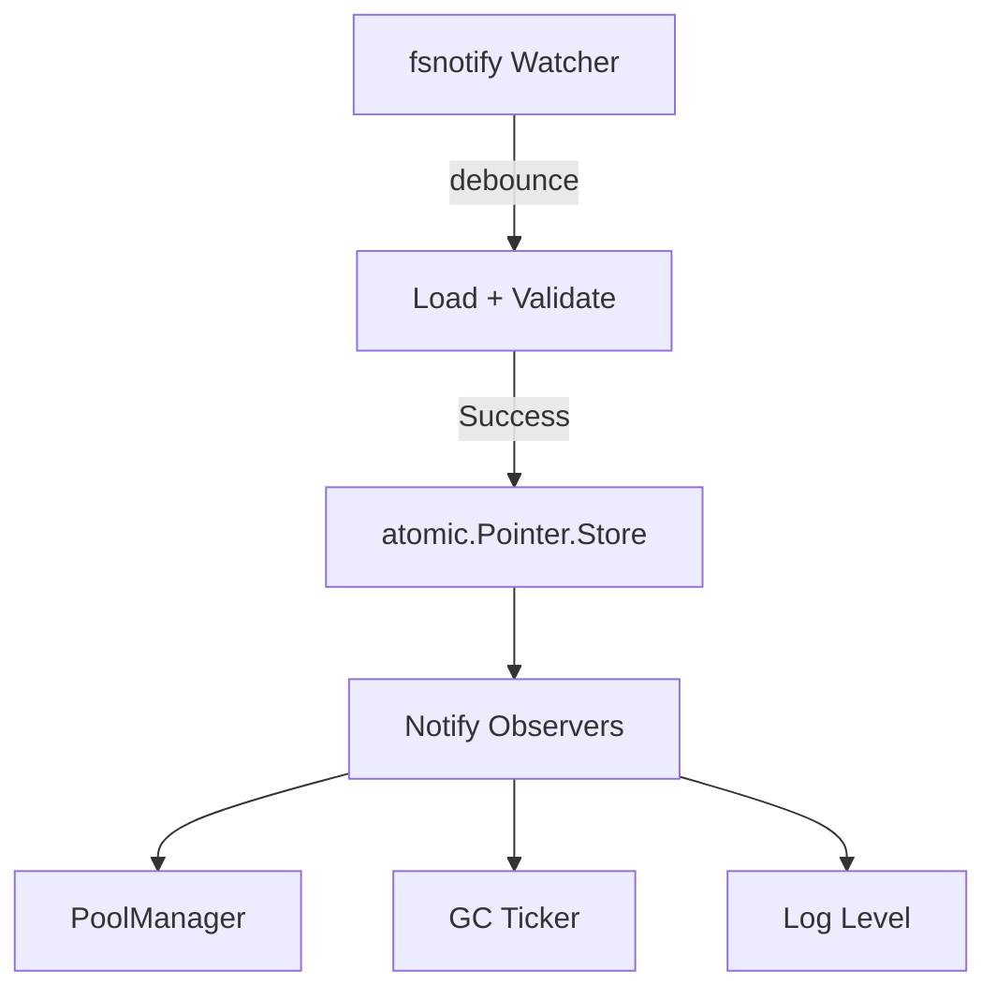

# HotPlex 配置热重载方案 (AEP-005)

**状态**：草案 (Draft)  
**所有者**：Antigravity  
**更新日期**：2026-04-22

> **目标**：基于 Go 最佳实践，修复并完善 HotPlex 的配置热重载机制，使运维人员可以在不重启进程的情况下调整关键运行参数。

---

## 1. 现状诊断

### 1.1 核心缺陷：指针隔离

在之前的版本中，`main.go` 的 `onChange` 回调虽然更新了局部变量 `cfg` 的指向，但各核心组件（Hub, Manager, Handler 等）持有的是初始化时的配置指针副本，导致全局更新无法触达各组件内部。

```go
main.go onChange:
  cfg = newCfg  ← 只更新了局部变量的指针指向

Hub       持有 *config.Config ← 仍指向旧对象
Manager   持有 *config.Config ← 仍指向旧对象
Handler   持有 *config.Config ← 仍指向旧对象
Authenticator 持有 *config.SecurityConfig ← 仍指向旧对象
```

**结果**：配置文件改了 → Watcher 检测到了 → 日志打了 "hot reload applied" → 但没有任何组件实际感知到变化。

### 1.2 diffConfigs 算法缺陷

原有的 `configSummary()` 仅比较 7 个字段（Addr, BroadcastQueueSize, GCScanInterval, MaxSize, MaxLifetime, IdleTimeout, RequestsPerSec），遗漏了 `HotReloadableFields` 中声称支持的其他字段。且所有变更统一报告为一个 `"config"` 字段变更，无法区分热更新字段和静态字段。

### 1.3 组件缺乏动态调整能力

| 组件 | 配置读取方式 | 问题 |
|------|-------------|------|
| `PoolManager` | 构造时复制限额为 int 字段 | 无 setter，构造后不可变 |
| `Manager.runGC` | 启动时创建 Ticker | Ticker 不可动态 Reset |
| `Conn.WritePump` | 包级常量 | 硬编码超时，无法通过配置覆盖 |
| `Hub.broadcast` | `make(chan)` | channel 容量不可动态更改 |
| `Authenticator` | 构造时预计算 map | 无法在不重启的情况下更新 API Keys |
| `LLMRetryController`| 构造时复制配置 | 无 reload 机制 |

---

## 2. Go 热重载最佳实践

### 2.1 核心原则

| 原则 | 说明 |
|------|------|
| **Immutable Config** | 永不修改已发布的 Config 对象，总是创建新实例后原子替换 |
| **atomic.Pointer[T]** | 使用 Go 1.19+ 原子指针实现线程安全、零锁读取 |
| **Validate-before-Apply** | 新配置先校验，失败则保留旧配置 |
| **Observer 通知** | 组件注册回调，配置变更时收到通知并自行调整内部状态 |
| **分层管控** | 明确区分可热更新 vs 需重启的字段 |

### 2.2 推荐架构



---

## 3. 实施方案

### Phase 1：中心化配置存储（核心基础设施）

引入 `ConfigStore` 消除指针隔离。
- 组件通过 `cfgStore.Load()` 获取当前不可变快照。
- 通过 `cfgStore.Swap()` 原子替换配置。

### Phase 2：Observer 通知链 + 字段级 Diff

- **Observer 接口**：各组件实现 `OnConfigReload` 响应变更。
- **反射 Diff**：基于 `reflect` 逐字段比较 `HotReloadableFields`。
- **组件对接**：
    * `PoolManager.UpdateLimits()`
    * `Manager.ResetGCInterval()`
    * `slog.LevelVar` 动态等级更新

### Phase 3：高级热更新（可选增强）

- API Keys 热重载。
- AllowedOrigins 动态化。
- Messaging Gate 策略热更新。

---

## 4. 配置分类表

### 🟢 可热更新 (Hot-Reloadable)

| 配置路径 | 影响组件 | 生效方式 |
|----------|---------|---------|
| `log.level` | slog | `LevelVar.Set()` |
| `pool.max_size` | PoolManager | `UpdateLimits()` |
| `pool.max_idle_per_user` | PoolManager | `UpdateLimits()` |
| `session.gc_scan_interval` | Manager | `ResetGCInterval()` |
| `worker.max_lifetime` | Manager (GC) | 每次 GC tick 动态读取 |
| `worker.auto_retry.*` | RetryController | `UpdateConfig()` |
| `admin.requests_per_sec` | RateLimiter | `UpdateRate()` |

### 🔴 需重启 (Static)

| 配置路径 | 原因 |
|----------|------|
| `gateway.addr` | 需重新绑定端口 |
| `gateway.broadcast_queue_size` | channel 容量不可变 |
| `db.path` | 数据库连接池无法平滑迁移 |
| `security.jwt_secret` | 加密上下文依赖 |

---

## 5. 关键设计决策

### 5.1 为什么选择 `atomic.Pointer`？
在高频消息处理路径上，原子读取比 `RWMutex` 更具性能优势，且能保证配置的完全不可变性。

### 5.2 为什么不热更新 broadcast channel 容量？
Go channel 容量不可变。重建 channel 涉及消息排空与恢复，逻辑复杂度极高且易引入死锁，建议作为静态配置。

---

## 6. 测试策略

| 测试类型 | 覆盖内容 |
|---------|---------|
| **单元测试** | `ConfigStore` 并发安全性、`diffConfigs` 精准度 |
| **集成测试** | 修改 YAML 后观察 `PoolManager.Stats()` 是否返回新限额 |
| **E2E 测试** | 运行时修改 `log.level` 验证日志等级实时变化 |
